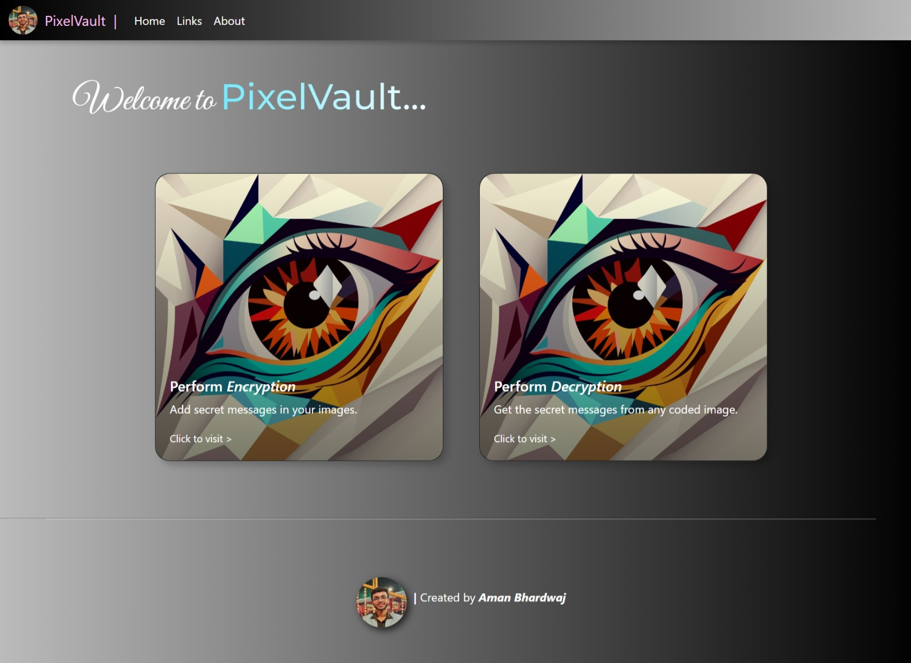
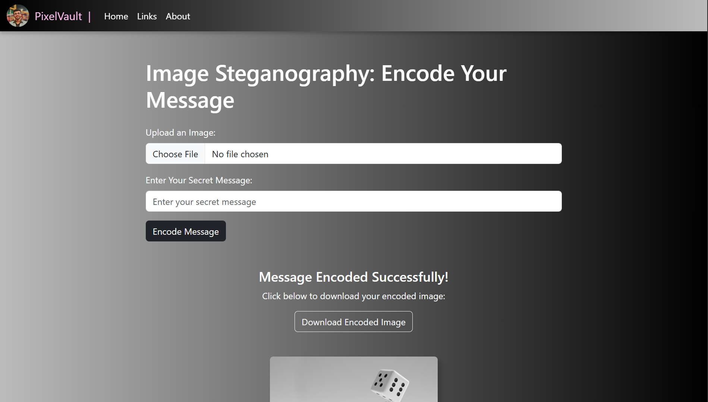
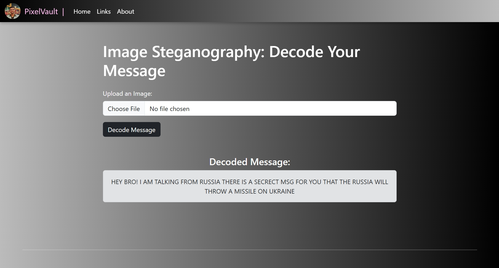

# PixelVault: The Art of Hidden Messages


## **About PixelVault**
PixelVault is an innovative image steganography tool that enables you to hide secret messages or data within images. Combining the power of advanced algorithms with a user-friendly interface, PixelVault empowers developers, researchers, and enthusiasts to explore the fascinating world of hidden communication.

---

## **Features**
- **Secure Encoding**: Hide your data within images using advanced steganography techniques.
- **Lossless Decoding**: Extract messages without altering the original image quality.
- **Image Support**: Compatible with a variety of image formats (e.g., PNG, JPEG).
- **Fast and Reliable**: Quick processing with minimal computational overhead.
- **Web Interface**: Intuitive and clean interface for seamless usability.

---

## **Applications**
1. **Data Privacy**: Hide sensitive information within innocuous-looking images.
2. **Digital Watermarking**: Protect intellectual property with embedded identifiers.
3. **Covert Communication**: Exchange messages securely in a visually undetectable way.
4. **Research and Education**: Experiment with steganographic methods and cryptography.

---


## **Getting Started**

### Prerequisites
- Python 3.8+ installed
- Required libraries:
  ```bash
  pip install Flask Pillow

---

## **Note:**
To use Metadata-Steganographer, run the app.py script. For pixel-based steganography, substitute the encode and decode functions in app.py with those found in pixel.py.

---

## **Previews:**
- ### Homepage



- ### Encoder Page



- ### Decoder Page


